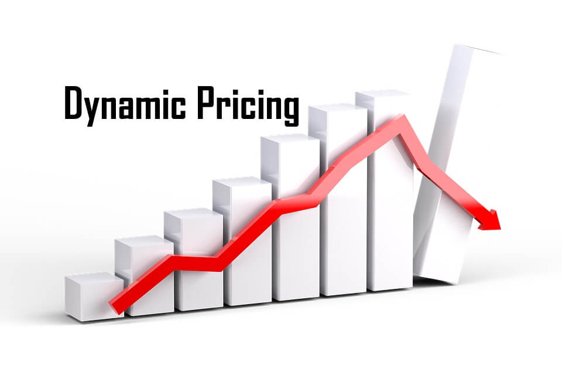
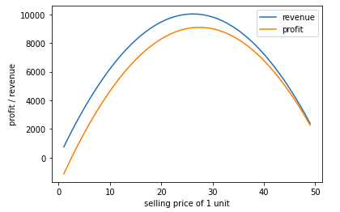
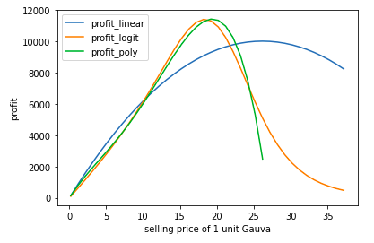

# Dynamic_Pricing

## Overview

   

Dynamic pricing, also called real-time pricing, is an approach to setting the cost for a product or service that is highly flexible. The goal of dynamic pricing is to allow a company that sells goods or services over the Internet to adjust prices on the fly in response to market demands.

## Results

   

   

